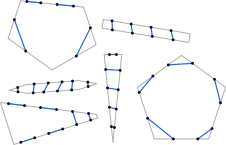
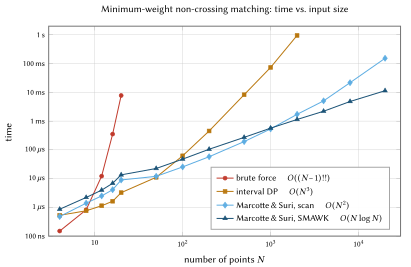

# mwpm — Minimum-Weight Perfect Matching on a Polygon

<p align="center">
  
</p>

For an even number of points in the plane, a _perfect matching_ connects up the points into pairs, using disjoint straight segments.  A perfect matching is _minimal_ if it minimizes the total segment length among all such matchings (and as a consequence, avoids crossing segments).

`mwpm` is a small C++17 library and CLI that finds a minimum-weight perfect matching of points lying on the boundary of a convex polygon.  It implements the `O(N log N)` Marcotte-Suri (MS) algorithm, as well as brute force (BF) and dynamic programming (DP) versions suitable for smaller inputs.  The CLI reads a polygon and boundary-point specification from JSON, computes the optimal matching, and writes the result back as JSON (with an optional SVG figure).

## Quick start

```bash
cmake -S . -B build && cmake --build build -j
./build/mwpm examples/triangle.json --svg
```

This prints the matching to stdout and writes `examples/triangle.json.svg`.

## CLI usage

```text
Usage:
  ./build/mwpm [options] <input.json>     compute a matching
  ./build/mwpm --benchmark [options]      benchmark / validate

Matching mode options:
  <input.json>             Input polygon and boundary points (JSON)
  -o, --output <file>      Write result JSON (default: stdout)
      --svg                Write SVG visualization to <input.json>.svg
      --simple-scan        Use O(N^2) scan instead of SMAWK
  -v, --validate           Cross-check BF / DP / MS on this input
```

### Input format

The input JSON has two fields:

- **`vertices`** — the polygon vertices in counterclockwise order, each given as `[x, y]`.
- **`edge_points`** — one array per edge (same length as `vertices`). Edge `e` runs from `vertices[e]` to `vertices[(e + 1) % n]`. Each entry is a sorted list of barycentric coordinates `s ∈ [0, 1]` locating a point at `(1 − s)·a + s·b` along that edge.

The total number of boundary points must be even (each point is matched exactly once). The vertex list must describe a **convex** polygon in **counterclockwise** order; the CLI rejects concave polygons, clockwise order, and odd point counts.

```json
{
  "vertices": [
    [0.0, 0.0],
    [10.0, 0.0],
    [5.0, 8.0]
  ],
  "edge_points": [
    [0.25, 0.75],
    [0.33, 0.66],
    [0.4, 0.8]
  ]
}
```

See the [`examples/`](examples/) directory for several example inputs.

```bash
for f in examples/*.json; do ./build/mwpm "$f" --validate; done
```

### Output format

The result JSON contains the total matching cost and the matched segments. Each segment endpoint is an `[edge, index]` pair referencing the input `edge_points` arrays:

```json
{
  "cost": 8.6976399850334687,
  "segments": [
    [[0, 1], [1, 0]],
    [[1, 1], [2, 0]],
    [[0, 0], [2, 1]]
  ]
}
```

Here `[[0, 1], [1, 0]]` matches the second point on edge 0 with the first point on edge 1.

### SVG visualization

Pass `--svg` to write a normalized 100×100 figure alongside the input file (`<input.json>.svg`).

```bash
./build/mwpm examples/triangle.json --svg -o result.json
# stdout: (nothing, result goes to result.json)
# stderr: Wrote examples/triangle.json.svg
```

## When to use which algorithm

<p align="center">
  
</p>

| input size | recommended algorithm | why |
| ---: | --- | --- |
| `N ≤ 12` | **brute force** or **interval DP** | both finish in microseconds; brute force is the simplest oracle. |
| `12 ≤ N ≤ 100` | **interval DP** | smallest constants of any algorithm in this regime — beats both MS variants by 2–4× on raw wall-clock. |
| `100 ≤ N ≤ 1500` | **Marcotte & Suri (simple scan)** | the `O(N²)` scan has tighter constants than SMAWK's recursion + allocation overhead until the asymptotics catch up. |
| `N ≥ 2000` | **Marcotte & Suri (SMAWK, the default)** | the `O(N log N)` bound starts to dominate; ~2× faster than scan at `N = 4000`, ~13× at `N = 20000`. |
| `N ≥ ~2000`, exact reproducibility wanted | **DP** *and* **MS** in validation mode | every release run cross-checks all four algorithms on the same inputs. |

The four implementations are:

1. **Brute force** — `O(N!!)` enumeration of every perfect matching, used as a ground-truth oracle for `N <= 20`.
2. **Interval DP** — `O(N^3)` dynamic program over contiguous sub-ranges of points in convex position.
3. **Marcotte & Suri `Find_Matching`** — divide-and-conquer with extensibility lemmas and dual-weight (`δ`) tracking, faithful to Figure 4 of the paper (see *Algorithm* below). The conquer step ships in two flavours:
   - *SMAWK (default).* Row-minima of the totally monotone weighted-distance
     matrix via the Aggarwal–Klawe–Moran–Shor–Wilber algorithm. Conquer is
     `O(|R| + |L|)`, so the recurrence solves to `O(N log N)` overall — the
     bound the paper claims.
   - *Simple scan (opt-in via `--simple-scan`).* Direct `O(|R|·|L|)`
     comparisons; conquer is `O(N²)` and the algorithm is `O(N²)` overall.
     Useful as a reference implementation and as a fallback for cross-
     validating the SMAWK path. Selectable via the `simple_scan=true` argument
     to `marcotte_suri_matching`.

All algorithms produce identical matching costs; validation mode runs them side-by-side on every trial.

## Algorithm

The `Find_Matching` implementation in `src/algorithms/marcotte_suri.cpp` is based on:

> Odile Marcotte and Subhash Suri,
> *Fast Matching Algorithms for Points on a Polygon*,
> SIAM J. Comput., **20**(3), pp. 405–422, June 1991.

Inline comments in that file reference the paper by line number of the `Find_Matching` procedure (Figure 4, p. 417) and by lemma number from sections 2–4.

The SMAWK matrix-searching subroutine used by the conquer step is the linear-time row-minima algorithm of:

> Alok Aggarwal, Maria M. Klawe, Shlomo Moran, Peter Shor, and Robert Wilber,
> *Geometric applications of a matrix-searching algorithm*,
> Algorithmica, **2** (1987), pp. 209–233.

Inputs to SMAWK are oriented top-to-bottom on each polygon side so the weighted-distance matrix is totally monotone in the standard sense.

## Building

Requirements:

- A C++17 compiler (Apple Clang, recent Clang, or GCC).
- CMake ≥ 3.16.

From the repo root:

```bash
cmake -S . -B build
cmake --build build -j
```

This produces `build/mwpm` (the CLI) and `build/libmwpm_lib.a` (the static
library). The build fetches [nlohmann/json](https://github.com/nlohmann/json)
automatically via CMake FetchContent.

## Library usage

```cpp
#include "mwpm/algorithms.hpp"
#include "mwpm/point.hpp"

// points must be ordered cyclically around a convex polygon's boundary, with
// an even total count.
std::vector<mwpm::Point> points = /* ... */;

mwpm::MatchingResult r = mwpm::marcotte_suri_matching(points);
// r.cost  == minimum total Euclidean weight
// r.pairs == vector of (i, j) index pairs into `points`

// To use the O(N^2) simple-scan conquer path (e.g. as an oracle in your own
// tests, or to bypass SMAWK for a tiny input):
auto r_scan = mwpm::marcotte_suri_matching(points, /*simple_scan=*/true);
```

`brute_force_matching` and `dp_matching` have the same return type but no
`simple_scan` parameter.

For JSON-based workflows, see `mwpm/geometry.hpp` and `mwpm/io.hpp`.

## Benchmarking and validation

The repo also ships a random-triangle benchmark driver for regression testing and performance measurement. Pass `--benchmark` (or `--validate`) to enter this mode — no input JSON is required.

```bash
# Timings on random triangles
./build/mwpm --benchmark -t 30 -m 1000 --seed 11

# Cross-check all four algorithms on every trial
./build/mwpm --validate --trials 5000 --max-points 30 --seed 8675309
```

Benchmark flags: `-t`, `-m`, `-e`, `--seed`, `--simple-scan`, `--skip-dp`,
`--skip-brute`. See `./build/mwpm --help` for the full list.

## Empirical performance

Per-trial averages on Apple Clang 17 / `-O3` (Release, Apple M4 Max), measured with the `--exact-points` flag so every trial uses the same `N`. All four algorithms were run on every `N` for which they were tractable; brute force is capped at `N ≤ 20` and DP is skipped above `N = 2000` to keep the sweep short.  Each cell is the mean wall-clock time for a single matching call.

|     N | trials |       BF |       DP | Paper (scan) | Paper (SMAWK) |
| ----: | -----: | -------: | -------: | -----------: | ------------: |
|     4 |   5000 |  0.15 μs |  0.53 μs |      0.48 μs |       0.86 μs |
|     8 |   2000 |  0.82 μs |  0.76 μs |      1.40 μs |       2.21 μs |
|    12 |   1000 |  12.2 μs |  1.14 μs |      2.50 μs |       3.97 μs |
|    16 |    200 |   353 μs |  1.63 μs |      4.11 μs |       6.87 μs |
|    20 |     30 |  7.77 ms |  3.25 μs |      8.97 μs |       13.5 μs |
|    50 |    500 |        – |  11.1 μs |      12.0 μs |       22.5 μs |
|   100 |    300 |        – |  62.1 μs |      25.5 μs |       47.6 μs |
|   200 |    100 |        – |   453 μs |      57.7 μs |        105 μs |
|   500 |     30 |        – |  8.26 ms |       194 μs |        272 μs |
|  1000 |     10 |        – |  73.7 ms |       535 μs |        569 μs |
|  2000 |      3 |        – |   954 ms |      1.72 ms |       1.14 ms |
|  4000 |      3 |        – |    skip  |      5.05 ms |       2.20 ms |
|  8000 |     10 |        – |    skip  |      21.7 ms |       4.81 ms |
| 20000 |      5 |        – |    skip  |       153 ms |       11.4 ms |

Sweep command (≈11 s wall-clock for the full table):

```bash
for N in 4 8 12 16 20 50 100 200 500 1000 2000 4000 8000 20000; do
  ./build/mwpm --benchmark -e $N -t <T> --seed 20260522 [--simple-scan] \
               [--skip-brute] [--skip-dp]
done
```

Take-aways:

- **Brute force** is fine up through `N ≈ 16` (sub-millisecond), but the `O(N!!)` factorial blowup is brutal: `N = 20` already takes ~8 ms per call, and each step of two doubles that.
- **DP** has by far the smallest constants — it beats both MS variants for every `N ≤ 50` and is competitive up to `N ≈ 100`. Past that, its `O(N³)` scaling dominates: `N = 1000` takes ~74 ms per match, `N = 2000` approaches one second, and `N = 4000` projects to ~10 s. We skip DP above `N = 2000` in this table.
- **MS (simple-scan)** beats **MS (SMAWK)** by a small constant factor up to roughly `N ≈ 1500`. SMAWK's recursion + vector-allocation overhead has not yet paid for itself at those sizes.
- Around `N ≈ 2000` SMAWK overtakes the simple scan, and the `log N` advantage compounds: ~2.3× faster at `N = 4000`, ~4.5× at `N = 8000`, and ~13× at `N = 20000`.
- Both MS variants finish a `N = 20000` matching in well under 200 ms — DP would take hours on the same input.

## License

This project is licensed under the [MIT License](https://opensource.org/license/mit).

The implementation in `src/algorithms/marcotte_suri.cpp` follows the exposition of Marcotte & Suri (1991); please cite the original paper if you use the MS algorithm.

